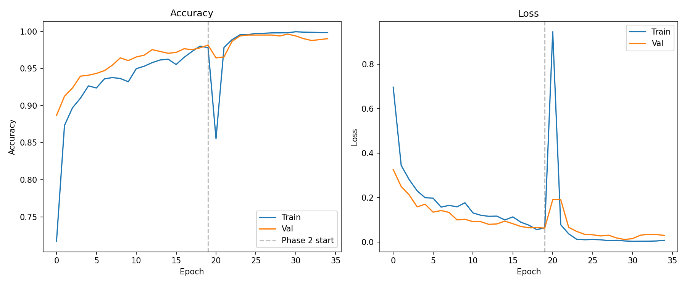
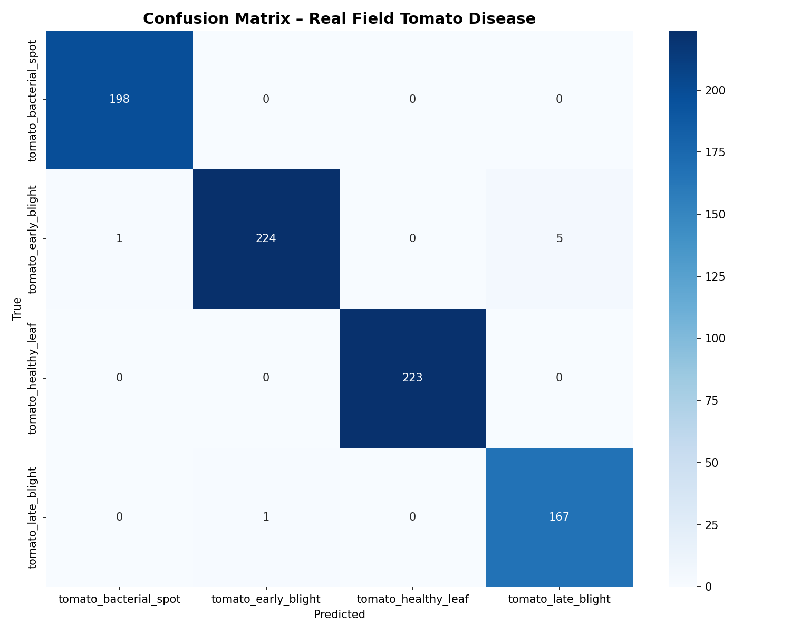
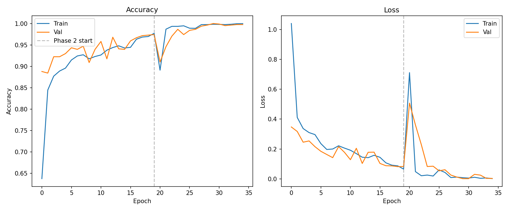
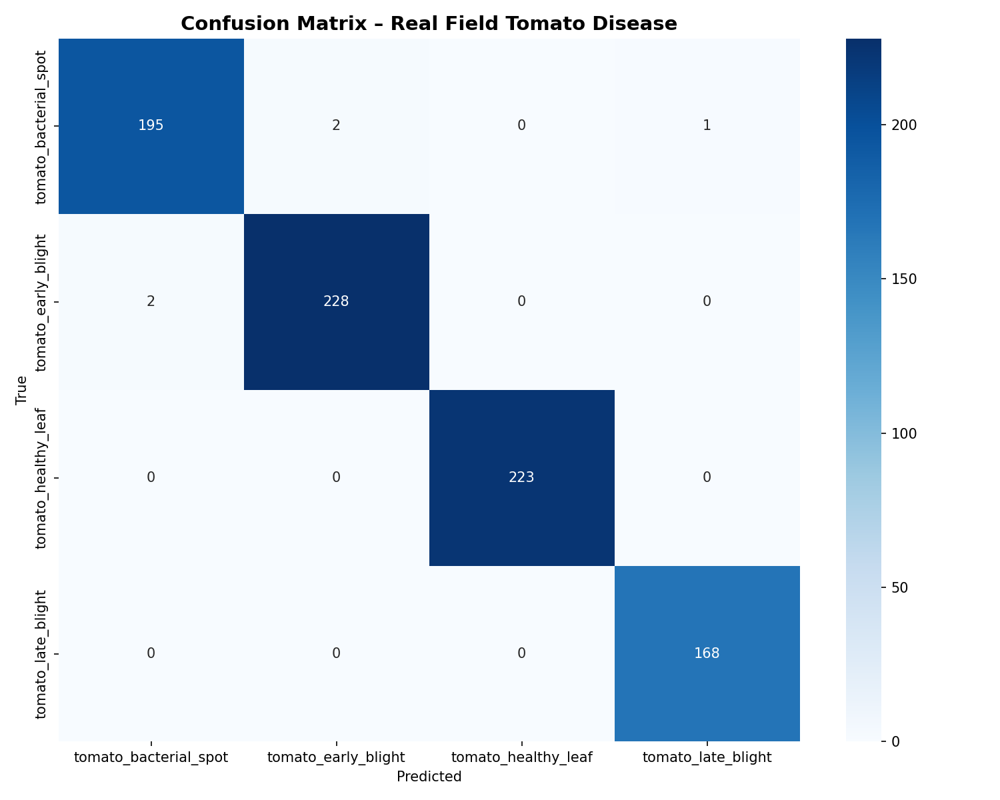
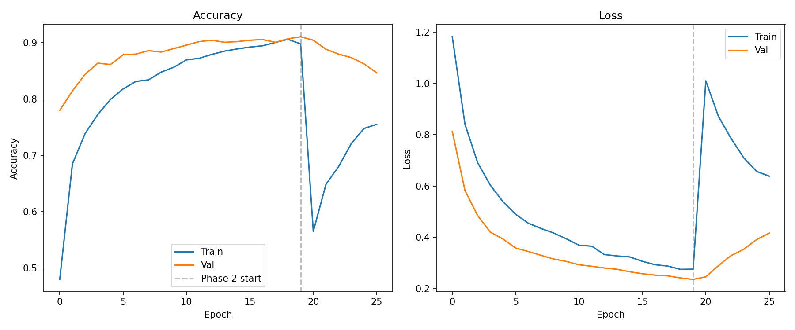
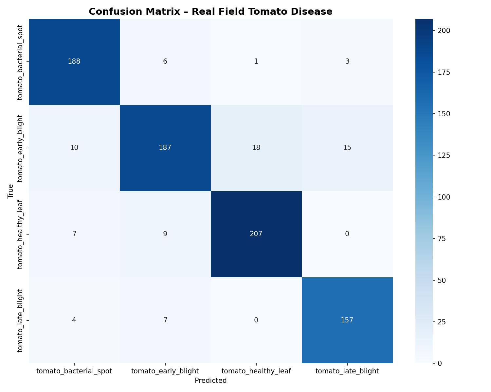
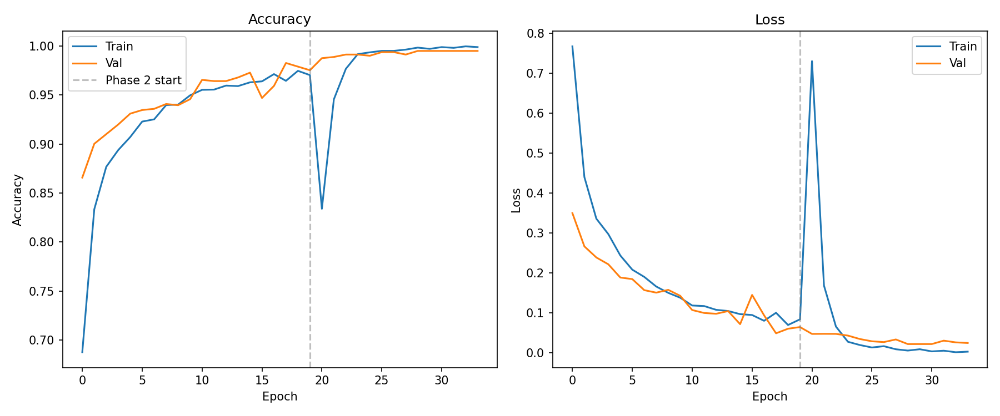
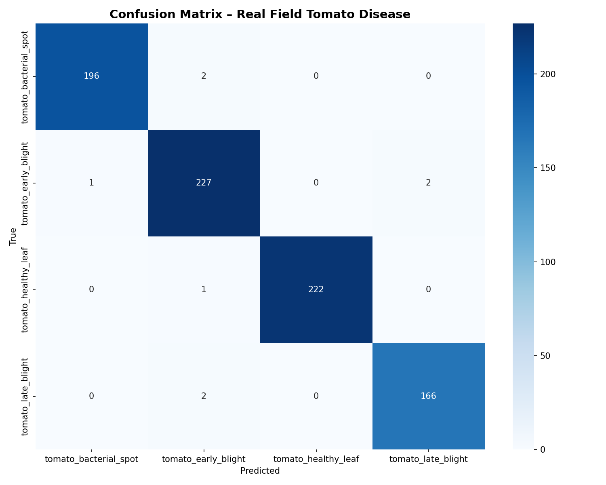
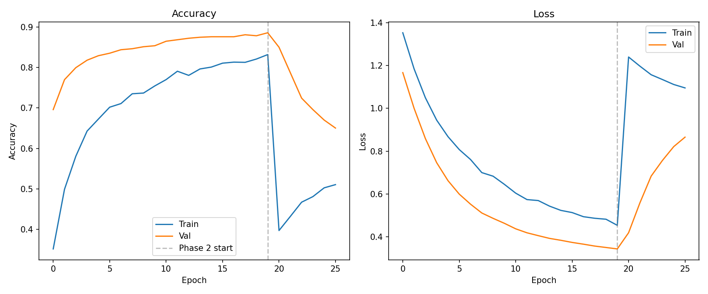
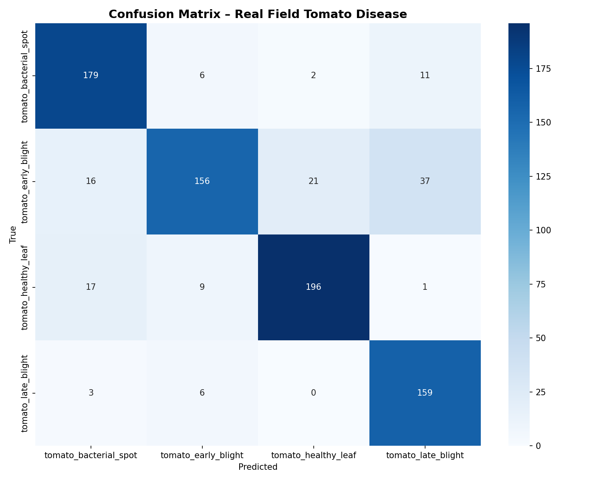

# 🍅 Tomato Plant Disease Identifier – STICS Project

A deep learning system for classifying real-field tomato leaf diseases using **EfficientNetB0** with two-phase transfer learning. Trained and benchmarked across five optimizers on an NVIDIA RTX 4060 / RTX 5060.

---

## 📋 Project Overview

This project classifies tomato plant diseases from real field images into four categories:

- `tomato_bacterial_spot`
- `tomato_early_blight`
- `tomato_healthy_leaf`
- `tomato_late_blight`

The pipeline uses TensorFlow with mixed precision (float16), tf.data optimized data loading, class-weighted loss for imbalance handling, and a two-phase training strategy (frozen base → fine-tuning).

---

## 🖥️ Hardware & Environment

| Component        | Details                        |
|------------------|-------------------------------|
| GPU              | NVIDIA RTX 4060 / RTX 5060    |
| CUDA Version     | 11.8                          |
| cuDNN Version    | 8.6                           |
| TensorFlow       | 2.10.0                        |
| OS               | Windows 10                    |
| Mixed Precision  | float16 (Tensor Core optimized)|

---

## 📦 Dataset

| Split      | Samples |
|------------|---------|
| Train      | 3,919   |
| Validation | 812     |
| Test       | 819     |
| Classes    | 4       |
| Imbalance Ratio | 1.48:1 |

---

## ⚙️ Training Configuration

| Parameter       | Value       |
|-----------------|-------------|
| Base Model      | EfficientNetB0 (ImageNet) |
| Image Size      | 224 × 224   |
| Batch Size      | 128         |
| Data Pipeline   | tf.data + cache + prefetch |
| Phase 1 Epochs  | Up to 20 (frozen base)     |
| Phase 2 Epochs  | Up to 30 (fine-tune top layers) |
| Early Stopping  | patience=5 on val_accuracy  |
| Reduce LR       | factor=0.2, patience=3      |

### Augmentation (Training Only)
- Random horizontal flip
- Random brightness (±0.2)
- Random contrast (0.8–1.2)
- Random crop (pad +20px then crop back)

---

## 👨‍💻 Team

| Optimizer | Reg# | Trained By       | Seed  |
|-----------|------|------------------|-------|
| Adam      | 9611 | Umar Khan        | 45673 |
| Nadam     | 9324 | Hasnain Shahzad  | 5674  |
| Adagrad   | 9652 | Faiz Behzad      | 44322 |
| RMSprop   | 9321 | Obaid Shah       | 5678  |
| SGD       | 9612 | Zain Ali         | 4321  |

---

## 📊 Results Summary

| Optimizer | LR (P1) | LR (P2) | Total Epochs | Test Accuracy | F1 (Weighted) | AUC (OvR) | Train Time |
|-----------|---------|---------|--------------|---------------|---------------|-----------|------------|
| Adam      | 0.003   | 0.0003  | 35           | **99.15%**    | **0.9915**    | **0.9997**| 3.15 min   |
| Nadam     | 0.01    | 0.001   | 35           | **99.39%**    | **0.9939**    | **1.0000**| 3.88 min   |
| Adagrad   | 0.01    | 0.001   | 26           | 90.23%        | 0.9014        | 0.9889    | 2.28 min   |
| RMSprop   | 0.001   | 0.0001  | 34           | 99.02%        | 0.9902        | 0.9998    | 3.25 min   |
| SGD       | 0.01    | 0.001   | 26           | 84.25%        | 0.9398        | 0.9728    | 2.26 min   |

> 🏆 **Best overall:** Nadam — 99.39% test accuracy, AUC = 1.0000

---

## 🔬 Optimizer Results

---

### 1. Adam
**Trained by:** Umar Khan (Reg# 9611) &nbsp;|&nbsp; **Seed:** 45673 &nbsp;|&nbsp; **Time:** 3.15 min

| Metric        | Value   |
|---------------|---------|
| Test Accuracy | 99.15%  |
| Precision (w) | 0.9916  |
| Recall (w)    | 0.9915  |
| F1 (w)        | 0.9915  |
| AUC (OvR)     | 0.9997  |
| Avg Inference | 225.3 ms|

**Training History**



**Confusion Matrix**



---

### 2. Nadam
**Trained by:** Hasnain Shahzad (Reg# 9324) &nbsp;|&nbsp; **Seed:** 5674 &nbsp;|&nbsp; **Time:** 3.88 min

| Metric        | Value   |
|---------------|---------|
| Test Accuracy | 99.39%  |
| Precision (w) | 0.9939  |
| Recall (w)    | 0.9939  |
| F1 (w)        | 0.9939  |
| AUC (OvR)     | 1.0000  |
| Avg Inference | 219.7 ms|

**Training History**



**Confusion Matrix**



---

### 3. Adagrad
**Trained by:** Faiz Behzad (Reg# 9652) &nbsp;|&nbsp; **Seed:** 44322 &nbsp;|&nbsp; **Time:** 2.28 min

| Metric        | Value   |
|---------------|---------|
| Test Accuracy | 90.23%  |
| Precision (w) | 0.9022  |
| Recall (w)    | 0.9023  |
| F1 (w)        | 0.9014  |
| AUC (OvR)     | 0.9889  |
| Avg Inference | 249.9 ms|

> ⚠️ Adagrad struggled with fine-tuning due to its accumulating gradient squares shrinking updates over time, causing accuracy to drop after Phase 2 start.

**Training History**



**Confusion Matrix**



---

### 4. RMSprop
**Trained by:** Obaid Shah (Reg# 9321) &nbsp;|&nbsp; **Seed:** 5678 &nbsp;|&nbsp; **Time:** 3.25 min

| Metric        | Value   |
|---------------|---------|
| Test Accuracy | 99.02%  |
| Precision (w) | 0.9903  |
| Recall (w)    | 0.9902  |
| F1 (w)        | 0.9902  |
| AUC (OvR)     | 0.9998  |
| Avg Inference | 226.7 ms|

**Training History**



**Confusion Matrix**



---

### 5. SGD
**Trained by:** Zain Ali (Reg# 9612) &nbsp;|&nbsp; **Seed:** 4321 &nbsp;|&nbsp; **Time:** 2.26 min

| Metric        | Value   |
|---------------|---------|
| Test Accuracy | 84.25%  |
| Precision (w) | 0.8493  |
| Recall (w)    | 0.8425  |
| F1 (w)        | 0.8398  |
| AUC (OvR)     | 0.9728  |
| Avg Inference | 253.5 ms|

> ⚠️ SGD showed the weakest performance, especially after fine-tuning where accuracy dropped significantly. SGD requires careful learning rate scheduling and momentum tuning to compete with adaptive optimizers on this task.

**Training History**



**Confusion Matrix**



---

## 🗂️ Repository Structure

```
├── train.py                          # Main training script
├── model_meta.json                   # Class names & architecture params
├── tomato_efficientnetb0_final.weights.h5  # Saved weights
├── results.csv                       # Per-run metrics
├── results/
│   ├── adam_confusion_matrix.png
│   ├── adam_training_history.png
│   ├── nadam_confusion_matrix.png
│   ├── nadam_training_history.png
│   ├── adagrad_confusion_matrix.png
│   ├── adagrad_training_history.png
│   ├── rmsprop_confusion_matrix.png
│   ├── rmsprop_training_history.png
│   ├── sgd_confusion_matrix.png
│   └── sgd_training_history.png
└── README.md
```

---

## 🚀 Quick Start

### Requirements

```bash
pip install tensorflow==2.10.0 scikit-learn matplotlib seaborn psutil
```

### CUDA Setup
- CUDA: **11.8**
- cuDNN: **8.6**
- Install via [NVIDIA CUDA Toolkit](https://developer.nvidia.com/cuda-11-8-0-download-archive)

### Run Training

```bash
python train.py
```

### Inference

```python
cls, conf, all_probs = predict_tomato_disease(r"path\to\leaf.jpg")
print(f"Predicted: {cls}  ({conf:.2%} confidence)")
```

### Reload Saved Model

```python
import json, numpy as np, tensorflow as tf
from tensorflow.keras.applications import EfficientNetB0
from tensorflow.keras.applications.efficientnet import preprocess_input
from tensorflow.keras.layers import Dense, GlobalAveragePooling2D, Dropout
from tensorflow.keras.models import Model

BASE_DIR     = r"H:\STICS\TomatoTrain"
weights_path = BASE_DIR + r"\tomato_efficientnetb0_final.weights.h5"
meta_path    = BASE_DIR + r"\model_meta.json"

with open(meta_path) as f:
    meta = json.load(f)

base_model = EfficientNetB0(weights='imagenet', include_top=False,
                            input_shape=(224, 224, 3))
x   = base_model.output
x   = GlobalAveragePooling2D()(x)
x   = Dense(256, activation='relu')(x)
x   = Dropout(0.5)(x)
x   = Dense(128, activation='relu')(x)
x   = Dropout(0.3)(x)
out = Dense(meta['num_classes'], activation='softmax', dtype='float32')(x)
model = Model(inputs=base_model.input, outputs=out)
model.load_weights(weights_path)
print("Model loaded ✅")
```

---

## 📌 Notes

- Mixed precision (float16) was used to maximize RTX 4060/5060 Tensor Core utilization.
- Class weights were applied during training to handle mild dataset imbalance (ratio 1.48:1).
- All models were evaluated on the same held-out test set of 819 images.
- Bootstrap confidence intervals (1000 iterations) were computed for accuracy reliability.
